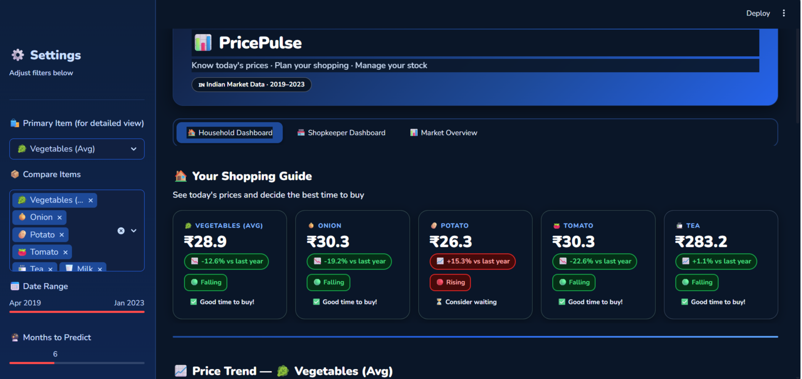
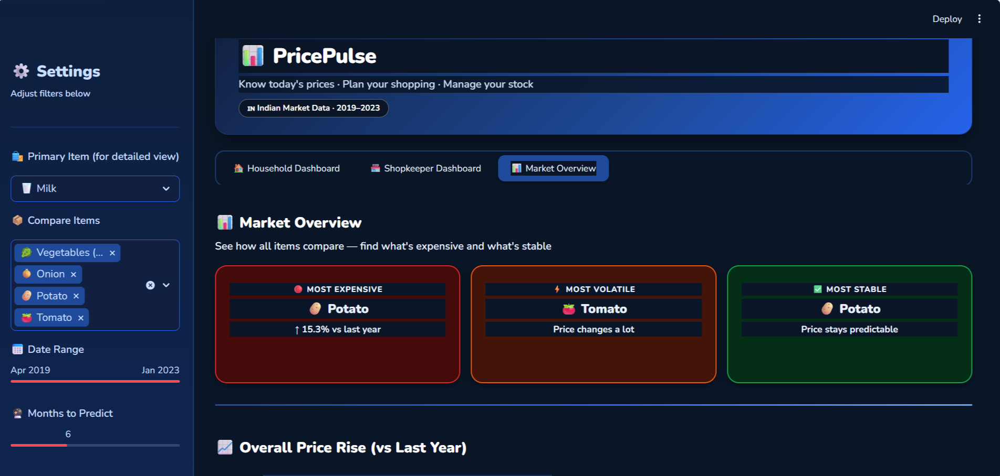
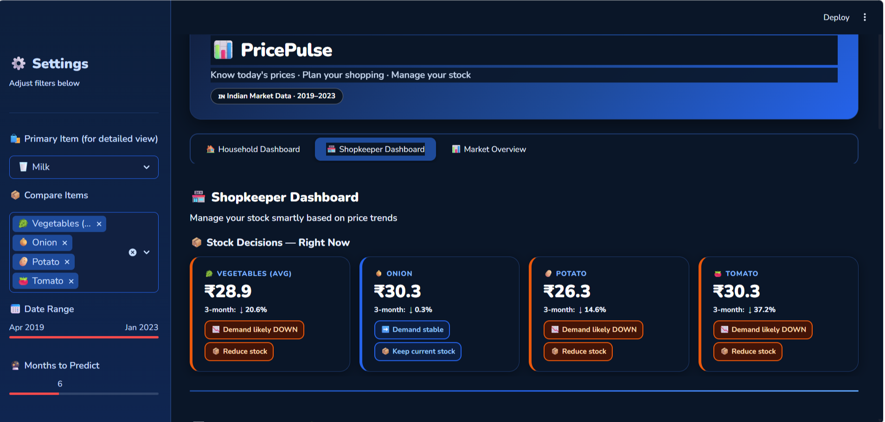
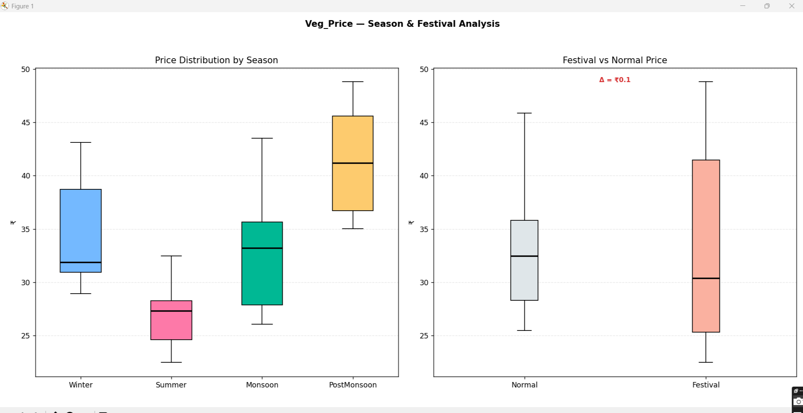
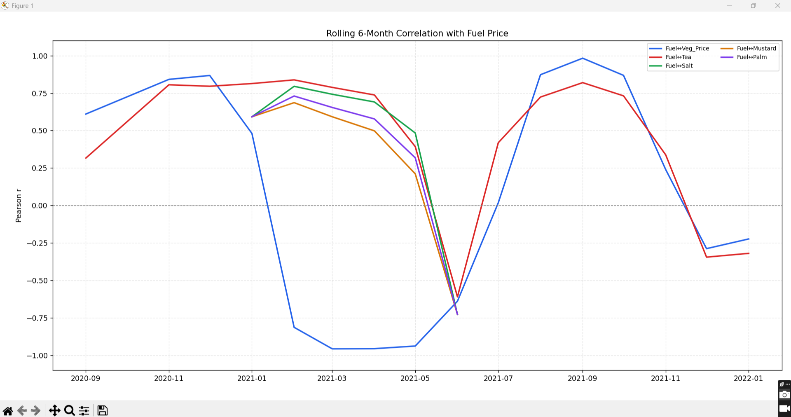
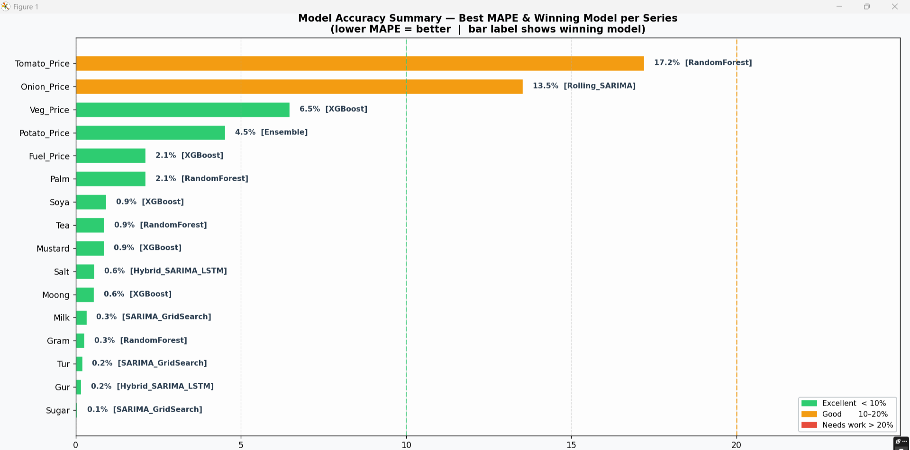
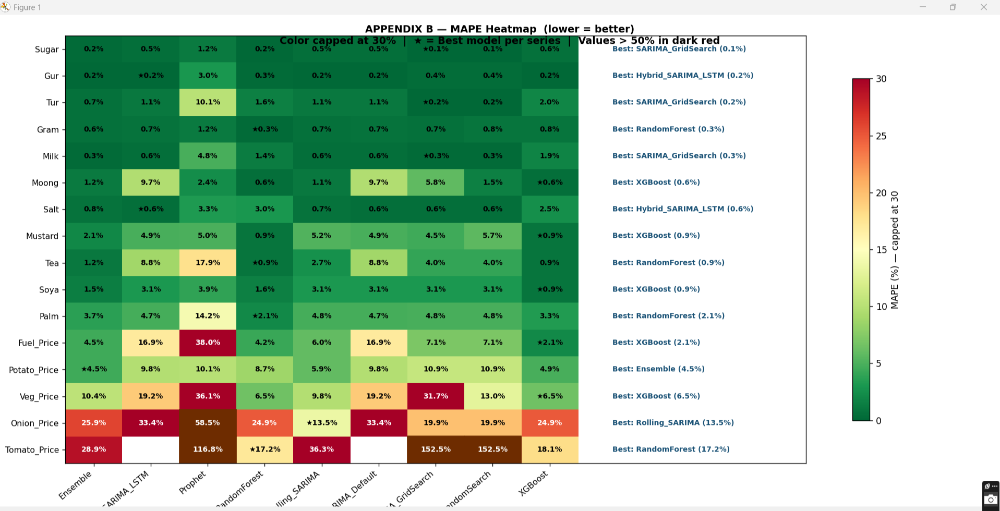
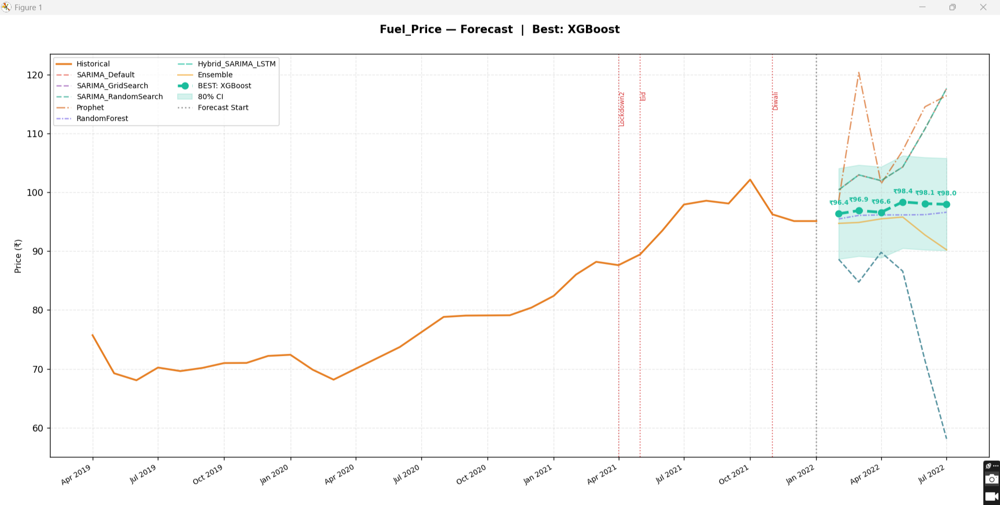

# 📈Inflation Trend Forecasting using Time Series and Machine Learning


## Project Overview
Inflation is one of the most significant economic indicators influencing the prices of essential commodities. This project analyzes historical price trends of vegetables, groceries, and fuel to identify inflation patterns and forecast future prices using statistical and machine learning techniques.
The project combines exploratory data analysis (EDA), feature engineering, seasonal decomposition, correlation analysis, inflation index calculation, and multiple forecasting models. The generated insights are presented through an interactive Streamlit dashboard, enabling users to explore historical trends, compare forecasting models, and better understand inflation behavior across different commodity categories.


## 🏗️ Project Architecture

```text
Historical Commodity Datasets
            │
            ▼
     Data Preprocessing
            │
            ▼
Exploratory Data Analysis (EDA)
            │
            ▼
Feature Engineering
            │
            ▼
Forecasting Models
(SARIMA • Prophet • XGBoost • Random Forest • Hybrid Models)
            │
            ▼
Model Evaluation
(MAE • RMSE • MAPE • SMAPE)
            │
            ▼
Interactive Streamlit Dashboard
```


## 🎯Objectives
- Analyze historical price trends of essential commodities.
- Study seasonal and inflation patterns across different commodity categories.
- Compare multiple forecasting models for price prediction.
- Evaluate model performance using standard forecasting metrics.
- Present insights through an interactive Streamlit dashboard.


## ✨Features
- Historical price trend analysis
- Seasonal decomposition (STL)
- Correlation and lag correlation analysis
- Inflation index visualization
- Feature engineering using lag and rolling statistics
- Multiple forecasting models
- Interactive Streamlit dashboard
- Model performance comparison using MAE, RMSE, MAPE, and SMAPE


## 🛠️Tech Stack

### 💻Programming Language
- Python

### Libraries & Frameworks
- Pandas
- NumPy
- Matplotlib
- Seaborn
- Scikit-learn
- Statsmodels
- Prophet
- XGBoost
- Streamlit

### Forecasting Models
- SARIMA
- Prophet
- Random Forest
- XGBoost
- Hybrid SARIMA + LSTM
- Rolling Walk-Forward SARIMA

### Evaluation Metrics
- MAE (Mean Absolute Error)
- RMSE (Root Mean Squared Error)
- MAPE (Mean Absolute Percentage Error)
- SMAPE (Symmetric Mean Absolute Percentage Error)

## 📊Datasets
The project analyzes historical prices of essential commodities collected from multiple categories:

- 🥕 Vegetables
- 🛒 Grocery Items
- ⛽ Fuel

The datasets were cleaned, preprocessed, and transformed before analysis and forecasting.


---


# 👥 Dashboard Modules

## 🏠 Household Dashboard
Provides price trends and buying recommendations to help consumers identify the best time to purchase essential commodities.



---

## 📈 Market Overview
Displays market-wide analytics, commodity comparisons, inflation trends, and forecasting insights.



---

## 🏪 Shopkeeper Dashboard
Provides inventory recommendations by analyzing price trends and expected demand movement.



---

# 📊 Exploratory Data Analysis
## Season & Festival Analysis
This analysis studies the influence of seasonal changes and festivals on commodity prices.



---

## Rolling Correlation Analysis
Rolling correlation captures how relationships between commodities evolve over time.



---

## 🤖Forecasting Models

The following forecasting techniques were implemented and compared:

- Grid Search SARIMA
- Random Search SARIMA
- Prophet
- XGBoost Regressor
- Random Forest Regressor
- Hybrid SARIMA + LSTM
- Rolling Walk-Forward SARIMA

Each model was evaluated using standard forecasting metrics to identify the best-performing approach for different commodity categories.


---

# 📈 Model Performance
Forecasting models were evaluated using MAE, RMSE, MAPE, and SMAPE.
Rather than relying on a single forecasting algorithm, the project compares multiple models and automatically identifies the best-performing model for each commodity.


---

## MAPE Heatmap
The heatmap provides a commodity-wise comparison of forecasting performance across all implemented models.


---

## Forecast Example
Example forecast generated using the best-performing model for Fuel Pric


---

# 🔍 Key Findings
- Different commodities require different forecasting models.
- XGBoost consistently achieved high forecasting accuracy across multiple commodities.
- SARIMA remained competitive for stable price series.
- Onion and Tomato prices exhibited the highest forecasting difficulty due to greater volatility.
- Seasonal and festival effects influenced commodity prices differently.
- Rolling correlation highlighted evolving relationships among commodities over time.

---


# 📂 Project Structure

```text
PricePulse/
│
├── assets/
├── datasets/
├── app.py
├── forecasting_pipeline.py
├── requirements.txt
├── README.md

```

# 🚀 Installation

Clone the repository.

```bash
git clone https://github.com/suyaljagrati3/PricePulse.git
```

Move into the project folder.

```bash
cd PricePulse
```

Install the required dependencies.

```bash
pip install -r requirements.txt
```

---


# ▶️ Running the Project

Run the forecasting pipeline.

```bash
python forecasting_pipeline.py
```

Launch the Streamlit dashboard.

```bash
streamlit run app.py
```

---

# 🔮Future Improvements
- Deep Learning-based forecasting models
- Transformer-based time-series forecasting
- Live commodity price APIs
- Automatic model retraining
- Cloud deployment
- Integration with macroeconomic indicators

---


# 👩‍💻My Contribution
This project was developed as part of my undergraduate coursework.
My primary contributions included:
- Conducting a literature review on inflation forecasting and commodity price prediction.
- Designing the end-to-end analytical workflow and forecasting pipeline.
- Comparing statistical and machine learning forecasting models.
- Performing exploratory data analysis, feature engineering, and visualization.
- Developing the Streamlit dashboard for interactive data exploration.
- Interpreting forecasting results and documenting key insights.

---

# Acknowledgements
This project was inspired by research in time-series forecasting and commodity price prediction. I studied multiple research papers to understand forecasting techniques, feature engineering, and evaluation strategies before designing this project.

I would also like to thank my faculty and teammate for her collaboration throughout the project.
